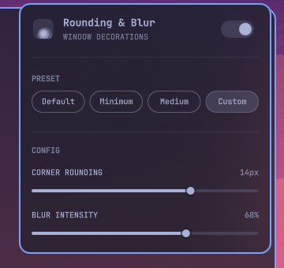

# Omablur

A bar panel (`"kind": "bar-widget"`) to tune window corner rounding and blur
intensity for [Omarchy](https://omarchy.org), without opening a config file.
Click the bar chip, pick a preset or drag a slider — the change applies to
the running Hyprland session immediately.



## Install

```bash
omarchy plugin add https://github.com/Charlieras262/omarchy-omablur.git --enable
```

`omarchy plugin update` later pulls new versions the same way any
git-managed plugin does.

## Use

Click the chip in the bar to open the panel:

- **The switch** next to the title turns everything off (rounding to 0,
  blur off) or back on — it remembers whatever was set before turning it
  off, for the current session, and falls back to **Default** if there's
  nothing to restore yet (e.g. right after a shell restart).
- **Default / Minimum / Medium** apply a fixed rounding + blur-intensity
  pair immediately. The active one is detected from Hyprland's own live
  values, not stored separately, so it stays correct even if you change
  something outside the panel.
- **Custom** reveals two sliders instead: **corner rounding** (0-20px,
  mapped 1:1 to Hyprland's `decoration:rounding`) and **blur intensity**
  (0-100%, converted to `decoration:blur:size`, 1-20 linear, and
  `decoration:blur:passes`, 1-3 stepped — each extra pass roughly doubles
  the GPU cost for a much smaller visual gain past 2-3, so a straight
  linear mapping would make the top half of the slider barely
  distinguishable but noticeably heavier).

Dragging a slider (or picking a preset) previews the change live via
`hyprctl eval` — nothing is written to disk until you release it or the
click lands. Once it does, the setting is persisted as a marked block in
your own `~/.config/hypr/looknfeel.lua`, so it survives a Hyprland restart:

```lua
-- BEGIN charlieras262.omablur
hl.config({
  decoration = {
    rounding = 8,
    blur = {
      enabled = true,
      size = 8,
      passes = 2,
      new_optimizations = true,
      ignore_opacity = true,
    },
  },
})
-- END charlieras262.omablur
```

Only the lines between those two markers are ever touched — anything else
you already have in `looknfeel.lua` is left exactly as it was.

### Rounding also applies to the shell itself

Corner rounding isn't only a window thing: Omarchy's own `Style.cornerRadius`
(used by every popup panel — Display, network, bluetooth, audio, etc.) already
mirrors `decoration:rounding` live, and
[omarchy-floating-bar](https://github.com/Charlieras262/omarchy-floating-bar)
1.4.0+ defaults its own corners to that same value when you haven't set an
explicit `cornerRadius` in its own config. Dragging Omablur's rounding slider
calls Omarchy's own `Style.refresh()` after each change, so both follow the
slider live, with no direct coupling between the three plugins — they all
just read the one shared value.

### Making blur actually visible

Hyprland only renders blur behind a surface that isn't fully opaque — an
opaque window or bar shows none of it, no matter how strong
`decoration:blur` is set. This plugin handles its own half of that: turning
blur on makes the bar translucent (the same transparency its own menu
toggle controls), and turning it off restores full opacity.

Regular app windows are a separate story — Hyprland has no idea which of
your windows you want see-through, so that's a per-app choice you make
yourself with a window rule. Omarchy's `o.window(match, rules)` helper (see
`$OMARCHY_PATH/default/hypr/windows.lua` for more examples) sets it:

```lua
-- ~/.config/hypr/hyprland.lua, or your own module required from it
o.window("firefox", { opacity = "0.90 0.90" })
o.window("^(kitty)$", { opacity = "0.85 0.80" })
```

The two numbers are active/inactive opacity (0.0-1.0). Without a rule like
this for an app, that app stays fully opaque and blur has nothing to show
through, even with Omablur's blur switched on.

## Remove

```bash
omarchy plugin remove charlieras262.omablur
```

This removes the plugin's files, but leaves the marked block above in
`looknfeel.lua` (Hyprland keeps using that rounding/blur setting after
removal, same as it would if you'd typed it in by hand). To drop it too:

```bash
python3 ~/.config/omarchy/plugins/charlieras262.omablur/compat/uninstall-looknfeel.py charlieras262.omablur
```

Run that *before* `omarchy plugin remove` (once removed, the script above
is gone too — in that case just delete the marked block from
`~/.config/hypr/looknfeel.lua` by hand).

## Dependencies

`hyprctl` (ships with Hyprland/Omarchy) for reading and applying live
values, and `python3` for the config-file writer. Everything else is plain
QML on Omarchy's own `qs.Commons`/`qs.Ui` modules — no external packages or
services.

## License

MIT — see [LICENSE](LICENSE).
